# Meridian Residences — Backend Deep Dive

> Generated from direct inspection of the actual repository contents on branch
> `feature/member1-lease` (repo: `Downloads\Meridian-Residences\`), including
> source files, tests, Alembic migrations, the team's design contract
> (`Documents/Team5_Meridian_Residences_Project_Design_Document.pdf`), and the
> remote branches `origin/feature-lavanya` and `origin/feature-Sanjana`.
> Everything here is verified against code — nothing is inferred from README
> placeholders alone. Implemented vs. planned status is called out explicitly
> throughout.

---

## Table of Contents

1. Project Overview
2. Backend Folder Structure
3. File-by-File Explanation
4. FastAPI Request Lifecycle
5. API Endpoint Guide
6. Endpoint Flowcharts
7. Authentication Deep Dive
8. Authorization and IDOR Protection
9. Database Deep Dive
10. SQLAlchemy Flow
11. Alembic Migrations
12. Seed Data
13. Response Structure
14. Lease Story Deep Dive
15. Dashboard Data Flow
16. Lease Page Data Flow
17. Frontend ↔ Backend Contract
18. Error Handling
19. Current Implementation vs Planned
20. `feature-lavanya` Branch
21. What Happens When I Run the Application
22. Local Development Guide
23. Beginner Explanation — "Backend in 10 Minutes"
24. Important Rules for Future Development
25. Final "How to Debug" Section

---

## 1. Project Overview

**Meridian Residences** is a resident portal for a serviced-apartment /
residential property. Residents log in (currently via a dev-only shortcut,
see §7) and can view their lease, upcoming invoices, and maintenance
requests, and — per the project's design contract, not yet built — chat with
an AI assistant grounded in lease/building-policy documents.

**What the backend is responsible for**: it is the single source of truth
for lease, unit, property and guest data. It authenticates requests, enforces
that a resident can only ever see their own data, talks to PostgreSQL, and
returns JSON in one fixed shape that the frontend is written to expect.

**How the three tiers communicate**:

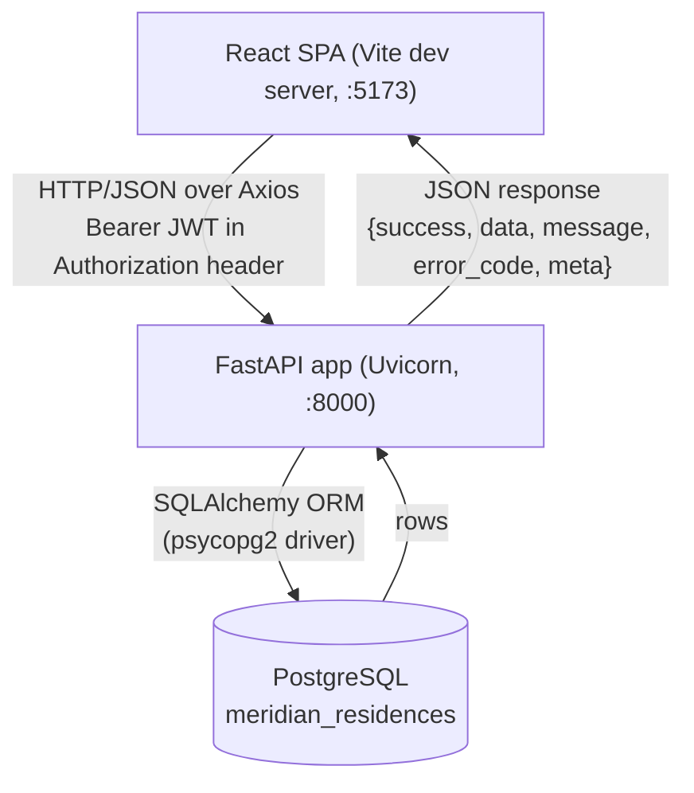

**Technologies actually used in this backend** (from `requirements.txt`):

| Package | Version | Role |
|---|---|---|
| fastapi | 0.115.6 | web framework |
| uvicorn[standard] | 0.34.0 | ASGI server |
| sqlalchemy | 2.0.36 | ORM |
| psycopg2-binary | 2.9.10 | PostgreSQL driver |
| alembic | 1.14.0 | migrations |
| pydantic / pydantic-settings | 2.10.4 / 2.7.0 | schemas & env config |
| python-jose[cryptography] | 3.3.0 | JWT |
| python-dotenv | 1.0.1 | loads `.env` |
| reportlab | 5.0.1 | PDF generation |
| pytest / httpx | 8.3.4 / 0.28.1 | testing |

**Current implementation status in one line**: one vertical story (Lease +
Dashboard) is fully built, tested, and running against a real Postgres
database; invoices, maintenance, AI assistant, and real login are scaffolded
folders/READMEs only **on this branch** (a teammate's unmerged branch,
`feature-lavanya`, appears to implement several of these already — see §20).

---

## 2. Backend Folder Structure

```
backend/
├── .env                      # local secrets/config (not committed — gitignored)
├── requirements.txt          # pinned dependencies
├── pytest.ini                # pytest config
├── .venv/                    # local virtualenv (not part of the app)
└── app/
    ├── __init__.py
    ├── main.py                          # IMPLEMENTED — app entrypoint
    ├── core/
    │   ├── config.py                    # IMPLEMENTED — Settings
    │   ├── database.py                  # IMPLEMENTED — engine/session
    │   ├── security.py                  # IMPLEMENTED — JWT + IDOR guard
    │   └── types.py                     # IMPLEMENTED — cross-dialect GUID
    ├── models/
    │   ├── guest.py                     # IMPLEMENTED
    │   ├── property.py                  # IMPLEMENTED
    │   ├── unit.py                      # IMPLEMENTED
    │   └── lease_agreement.py           # IMPLEMENTED
    │   (README.txt also names RecurringInvoice, MaintenanceTicket,
    │    Reservation, RatePlan, Folio, Order — PLANNED, no files exist)
    ├── routers/
    │   ├── leases.py                    # IMPLEMENTED
    │   └── dev_auth.py                  # IMPLEMENTED (dev-only)
    │   (README.txt also names invoices.py, maintenance.py, assistant.py —
    │    PLANNED, no files exist)
    ├── schemas/
    │   ├── common.py                    # IMPLEMENTED — response envelope
    │   └── lease.py                     # IMPLEMENTED
    │   (README.txt implies more per-story schemas — PLANNED)
    ├── services/
    │   ├── lease_service.py             # IMPLEMENTED
    │   └── lease_agreement_pdf.py       # IMPLEMENTED
    │   (README.txt also names invoice_service.py, maintenance_service.py,
    │    assistant_service.py — PLANNED, no files exist; lease_service.py
    │    already contains soft-import hooks for the first two, see §14)
    ├── ai/
    │   └── README.txt only              # PLANNED — RAG, triage agent, embeddings
    └── tests/
        └── test_leases.py               # IMPLEMENTED — 16 tests
```

### Why each implemented file exists, and what breaks without it

| File | Responsibility | Used by | If removed |
|---|---|---|---|
| `app/main.py` | Creates the FastAPI app, wires middleware, registers routers, defines exception handlers | Uvicorn's entrypoint (`app.main:app`) | Nothing starts — there is no server |
| `app/core/config.py` | Loads `.env` into a typed `Settings` object | `main.py`, `database.py`, `security.py`, `dev_auth.py` | Every module that reads `settings.*` fails to import |
| `app/core/database.py` | One shared SQLAlchemy engine/session + `Base` + `get_db()` | Every router/service that touches the DB; every model (`Base` subclass) | No DB access anywhere; models can't even be defined (they inherit `Base`) |
| `app/core/security.py` | Decodes JWTs, builds `CurrentUser`, centralizes the "is this yours" check | `routers/leases.py`, `routers/dev_auth.py`, `tests/test_leases.py` | No authentication; every protected route would need its own (inconsistent) auth logic |
| `app/core/types.py` | `GUID` — lets the same model code run on real Postgres UUIDs and on SQLite (for tests) | Every model (`guest.py`, `property.py`, `unit.py`, `lease_agreement.py`) | Models couldn't declare UUID primary keys in a dialect-portable way; the SQLite-based test suite would break |
| `app/models/*.py` | SQLAlchemy ORM table definitions | `lease_service.py`, `lease.py` schemas, Alembic migrations conceptually mirror these | No ORM access to `guests`/`properties`/`units`/`lease_agreements` |
| `app/routers/leases.py` | HTTP layer for the 5 lease endpoints | Registered into `main.py` | Those 5 endpoints vanish (404 on every path) |
| `app/routers/dev_auth.py` | Dev-only token-mint endpoint | Registered into `main.py`; called by the frontend's `AuthContext.jsx` on startup | Local frontend dev would have no way to get a token at all (no real login exists yet) |
| `app/services/lease_service.py` | All business logic for the lease story | `routers/leases.py` | Router would have nowhere to delegate logic; would have to inline DB queries into HTTP handlers |
| `app/services/lease_agreement_pdf.py` | Renders the actual PDF bytes for `/leases/{id}/agreement` | `lease_service.py` | Download-agreement endpoint would have nothing to return |
| `app/schemas/common.py` | The shared `SuccessResponse`/`ListResponse`/`ErrorResponse`/`Meta` envelope | `routers/leases.py`, `routers/dev_auth.py`, exception handlers in `main.py` | Every response would need its own ad-hoc shape, breaking the frontend's expectations |
| `app/schemas/lease.py` | Pydantic I/O models for lease data, incl. the `MoneyAmount` Decimal→JSON-number fix | `routers/leases.py`, `services/lease_service.py` | No validated/serializable shape for lease responses |
| `app/tests/test_leases.py` | Regression safety net for the whole lease story | Run via `pytest` | No automated verification that lease/auth/IDOR behavior still works after a change |

`app/ai/README.txt` and the "planned" entries in `routers/`, `services/`,
`schemas/`, `models/` READMEs are **not implemented** — they are literally
just text files describing intent. Do not treat them as working code.

---

## 3. File-by-File Explanation

### `backend/app/main.py` — IMPLEMENTED

Conceptual flow:

```
main.py
  ↓ creates FastAPI(title=settings.app_name)
  ↓ adds CORSMiddleware (origins from settings.cors_origins)
  ↓ adds a custom middleware that stamps every request with a UUID request_id
  ↓ registers @app.exception_handler for StarletteHTTPException and RequestValidationError
  │    (both rewrite errors into the shared {success:false, ...} envelope)
  ↓ app.include_router(leases.router, prefix="/api/v1")
  ↓ app.include_router(dev_auth.router, prefix="/api/v1")
  ↓ defines GET /health (plain {"status": "ok"}, no envelope)
  ↓ Uvicorn imports this module's `app` object and serves it
```

Only two routers are registered — this is the authoritative proof that
invoices/maintenance/assistant are not wired up on this branch, regardless of
what any README says.

### `backend/app/core/config.py` — IMPLEMENTED

A single `pydantic-settings` `Settings` class reads `backend/.env` (falls
back to hardcoded defaults if a variable is missing). Holds `app_name`,
`app_env`, `app_host`, `app_port`, `api_prefix`, `database_url`,
`cors_origins`, `jwt_secret_key`, `jwt_algorithm`, `jwt_expire_minutes`,
`log_level`. A single module-level `settings = Settings()` instance is
imported everywhere config is needed — there is exactly one source of truth
for configuration.

### `backend/app/core/database.py` — IMPLEMENTED

```
create_engine(settings.database_url, pool_pre_ping=True)
  ↓
SessionLocal = sessionmaker(bind=engine)
  ↓
class Base(DeclarativeBase): pass      # every model inherits this
  ↓
def get_db():                          # FastAPI dependency
    db = SessionLocal()
    yield db          # handed to the route/service
    db.close()        # always closes, even on error, via try/finally
```

`get_db` is a **generator dependency** — FastAPI calls it, gets one session
per request via `yield`, and guarantees cleanup afterward. Every DB-touching
endpoint declares `db: Session = Depends(get_db)`.

### `backend/app/core/security.py` — IMPLEMENTED

Three responsibilities, deliberately centralized in one file (see §7 and §8
for the full walkthrough):

1. `create_access_token(guest_id, role="resident")` — signs a JWT. Exists so
   tests (and eventually whoever builds a real login) have one consistent
   way to mint a token. **Not wired to any HTTP route itself.**
2. `get_current_guest_id(...)` — a FastAPI dependency that decodes the bearer
   token from the `Authorization` header into a `CurrentUser(guest_id, role)`
   dataclass. This is the *only* source of identity — a `guest_id` typed
   into a URL by the browser is never trusted on its own.
3. `authorize_lease_access(lease, current_user)` — the shared "is this
   resident allowed to see this lease" check, used by every lease-owning
   endpoint.

### `backend/app/core/types.py` — IMPLEMENTED

`GUID` is a SQLAlchemy `TypeDecorator`: on PostgreSQL it stores a native
`UUID`; on any other dialect (i.e., SQLite, used only by the test suite) it
falls back to a `CHAR(32)` hex string. This is what lets `test_leases.py` run
against an in-memory SQLite database with zero code differences from
production.

### `backend/app/routers/leases.py` — IMPLEMENTED

Defines 5 endpoints (full detail in §5). Every handler follows the same
shape: accept path/query params → resolve `current_user` via
`Depends(get_current_guest_id)` → delegate all real work to
`lease_service.*` → wrap the result in `SuccessResponse`/`ListResponse`. The
file's own docstring states the three GET endpoints are "frozen" (contract
§9.2/§17 — can't be renamed) while `/agreement` and `/renewal-request` are
later, additive extensions.

### `backend/app/routers/dev_auth.py` — IMPLEMENTED (dev-only)

One endpoint, `POST /dev-auth/token`. Immediately 404s unless
`settings.app_env == "development"`. Looks up the given `guest_id` in the
`guests` table (404 if not found), then calls `create_access_token`. This
file's own docstring is explicit: *"NOT part of the frozen API contract and
NOT a real login story... Remove or replace once the team decides who owns
real authentication."*

### `backend/app/services/lease_service.py` — IMPLEMENTED

The business-logic layer behind every lease router function. Key behaviors:

- `get_lease_detail` / `get_leases_for_guest` / `get_lease_agreement_pdf` /
  `request_lease_renewal` / `get_dashboard_summary` — one function per
  router endpoint, each starting with `authorize_lease_access(...)`.
- `get_leases_for_guest` additionally checks role: a non-staff/admin caller
  requesting someone else's guest id gets an **empty list**, not an error
  (contract §16.2).
- `request_lease_renewal` is idempotent: only sets `renewal_requested_at` if
  it isn't already set, and rejects (`409 LEASE_NOT_ACTIVE`) leases that
  aren't `active`.
- `_next_payment_and_activity` and `_maintenance_summary_and_activity` are
  the deliberate integration seam for the not-yet-built stories: each tries
  `from app.services import invoice_service` / `maintenance_service` inside
  a `try/except ImportError`, and returns empty/default values if the module
  (or the specific function on it) doesn't exist. This is *why* the
  dashboard doesn't crash today even though those services don't exist.

### `backend/app/services/lease_agreement_pdf.py` — IMPLEMENTED

`generate_lease_agreement_pdf(lease)` builds a real PDF **in memory** with
`reportlab` (title, parties, a details table, terms, a signature block) from
the lease's own `guest`/`unit`/`property` relationships, and returns raw
bytes. Nothing is read from or written to disk — `lease.agreement_file_url`
is only used elsewhere as a boolean-ish marker ("is an agreement available"),
never as an actual file path.

### `backend/app/schemas/common.py` — IMPLEMENTED

Defines the entire response contract used everywhere: `Meta` (request_id,
page, page_size, total), `SuccessResponse[T]`, `ListResponse[T]`,
`ErrorResponse`. Generic (`Generic[T]`) so every endpoint can declare its own
payload type while reusing the same envelope shape. See §13 for full detail.

### `backend/app/schemas/lease.py` — IMPLEMENTED

All Pydantic I/O models for the lease story: `UnitOut`, `PropertyOut`,
`LeaseOut` (+ `.from_model()` classmethod), `LeaseListItemOut`,
`RenewalRequestOut`, `NextPaymentOut`, `ActivityItemOut`, `LeaseSummaryOut`.
Also defines `MoneyAmount`, a `Annotated[Decimal, PlainSerializer(...)]` type
that forces money fields to serialize as plain JSON numbers instead of
Pydantic v2's default (a string) — see §13 for why this matters.

### `backend/app/models/` — all 4 files IMPLEMENTED

`guest.py`, `property.py`, `unit.py`, `lease_agreement.py` — full detail in
§9. Every model uses `GUID()` PKs/FKs and inherits `Base` from
`core/database.py`.

### Database migrations — all 3 IMPLEMENTED (full detail in §11)

`database/migrations/versions/0001_create_shared_baseline_tables.py`,
`0002_create_units_and_lease_agreements.py`,
`0003_add_lease_renewal_requested_at.py`.

---

## 4. FastAPI Request Lifecycle

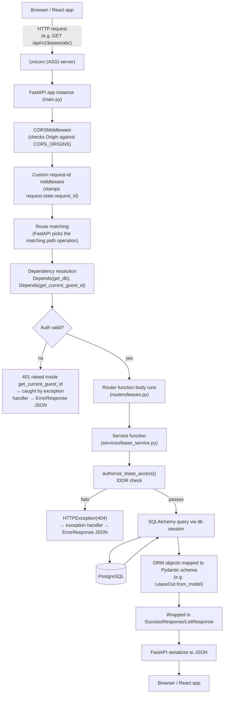

Step-by-step:

1. **Browser → Uvicorn**: the Axios call hits `http://localhost:8000/...`.
2. **CORS middleware**: rejects the request at the browser level if its
   Origin isn't in `CORS_ORIGINS` (this is a *browser-enforced* check — a
   tool like `curl` bypasses it entirely, which matters when debugging: see
   §25).
3. **Request-id middleware**: attaches a UUID to `request.state.request_id`
   so every response (success or error) can be traced back to one request.
4. **Route matching**: FastAPI resolves which function in `leases.py` or
   `dev_auth.py` should handle this path + method.
5. **Dependency injection**: `Depends(get_db)` opens one DB session for the
   life of the request; `Depends(get_current_guest_id)` decodes the JWT
   *before* the route body ever runs. If the token is missing/invalid, a
   `401` is raised right here — the route body never executes.
6. **Router → Service**: the router function is intentionally thin — it
   calls straight into `lease_service.py` and does no business logic itself.
7. **Authorization**: `authorize_lease_access` runs inside the service,
   before any data is returned — a uniform `404` if the lease doesn't exist
   *or* belongs to someone else.
8. **SQLAlchemy → PostgreSQL**: the service issues an ORM query
   (`db.get(...)` or `db.execute(select(...))`), which SQLAlchemy compiles
   to SQL and sends to Postgres via `psycopg2`.
9. **Model → Schema**: raw ORM rows are converted into Pydantic response
   models (e.g. `LeaseOut.from_model(lease)`).
10. **Envelope**: the schema is wrapped in `SuccessResponse`/`ListResponse`.
11. **Serialization**: FastAPI turns the Pydantic model into JSON (this is
    also where `MoneyAmount`'s custom serializer runs).
12. **Response → Browser**: Axios resolves the promise; `leaseService.js`
    hands the parsed `.data` up to the React component.

---

## 5. API Endpoint Guide

All paths below are prefixed with `/api/v1` (from `settings.api_prefix`),
except `/health`. Verified directly against `routers/leases.py` and
`routers/dev_auth.py`.

### `POST /api/v1/dev-auth/token`

- **Purpose**: mint a JWT for a given, already-existing guest — a stand-in
  for real login, local-dev only.
- **Auth required**: none (this endpoint *issues* auth).
- **Path params**: none.
- **Query params**: `guest_id` (UUID, required).
- **Request body**: none.
- **Router function**: `dev_auth.issue_dev_token`.
- **Service called**: none — queries `Guest` directly via `db.get(Guest, guest_id)`.
- **Models involved**: `Guest`.
- **Response schema**: `SuccessResponse[dict]` → `{access_token, guest_id}`.
- **Errors**:
  - `404` (plain, no body detail) if `settings.app_env != "development"`.
  - `404 GUEST_NOT_FOUND` if the guest doesn't exist.
- **Authorization/IDOR**: none applicable — there's no identity to protect yet.

### `GET /api/v1/leases/{lease_id}`

- **Purpose**: full lease detail (unit + property nested).
- **Auth required**: yes (Bearer JWT).
- **Path params**: `lease_id` (UUID).
- **Query params**: none.
- **Request body**: none.
- **Router function**: `leases.get_lease`.
- **Service called**: `lease_service.get_lease_detail`.
- **Models involved**: `LeaseAgreement` (+ its `unit` and `unit.property` relationships).
- **Response schema**: `SuccessResponse[LeaseOut]`.
- **Response structure** (verified against `schemas/lease.py`):
  ```json
  {
    "success": true,
    "data": {
      "id": "uuid", "unit_id": "uuid", "guest_id": "uuid",
      "unit": {"unit_number": "101", "unit_type": "2BHK"},
      "property": {"name": "Meridian Residences", "address": "..."},
      "start_date": "2026-01-01", "end_date": "2026-12-31",
      "monthly_rate": 45000.0, "renewal_date": "2026-12-01",
      "status": "active", "agreement_file_url": "generated",
      "renewal_requested_at": null
    },
    "message": "Lease details fetched successfully",
    "meta": {"request_id": "uuid"}
  }
  ```
- **Errors**: `401` (missing/invalid token), `404 LEASE_NOT_FOUND` (missing
  or belongs to another resident), `422` (invalid UUID in the path).
- **Authorization/IDOR**: `authorize_lease_access` — a resident gets the same
  `404` whether the lease truly doesn't exist or just isn't theirs.

### `GET /api/v1/guests/{guest_id}/leases`

- **Purpose**: paginated list of a guest's leases (for the "My Lease" /
  dashboard bootstrap flow).
- **Auth required**: yes.
- **Path params**: `guest_id` (UUID).
- **Query params**: `page` (default 1, ≥1), `page_size` (default 20, 1–100).
- **Request body**: none.
- **Router function**: `leases.get_guest_leases`.
- **Service called**: `lease_service.get_leases_for_guest`.
- **Models involved**: `LeaseAgreement` (+ `unit`).
- **Response schema**: `ListResponse[LeaseListItemOut]`.
- **Response structure**:
  ```json
  {
    "success": true,
    "data": [{"id": "...", "unit_id": "...", "unit": {...}, "status": "active", "start_date": "...", "end_date": "...", "monthly_rate": 45000.0}],
    "meta": {"request_id": "...", "page": 1, "page_size": 20, "total": 2}
  }
  ```
- **Errors**: `401`, `422` (bad UUID/pagination values).
- **Authorization/IDOR**: a resident (non-staff/admin) requesting a
  `guest_id` that isn't their own gets `[]` with `total: 0` — **not** a 404
  or 403 — a quieter form of the same protection, defined in the service
  layer rather than `authorize_lease_access`.

### `GET /api/v1/leases/{lease_id}/summary`

- **Purpose**: the shape `Dashboard.jsx` actually renders.
- **Auth required**: yes.
- **Path params**: `lease_id` (UUID).
- **Query/body**: none.
- **Router function**: `leases.get_lease_summary`.
- **Service called**: `lease_service.get_dashboard_summary`.
- **Models involved**: `LeaseAgreement`, `Unit`; *attempts* to involve
  invoice/maintenance data that doesn't exist yet (degrades gracefully).
- **Response schema**: `SuccessResponse[LeaseSummaryOut]`.
- **Response structure** (fields explained fully in §15):
  ```json
  {
    "success": true,
    "data": {
      "lease_id": "uuid",
      "unit": {"unit_number": "101", "unit_type": "2BHK"},
      "next_payment": null,
      "open_requests": 0,
      "open_request_status": null,
      "lease_status": "active",
      "lease_end_date": "2026-12-31",
      "activities": [{"id": "lease-uuid", "type": "lease", "title": "Lease agreement available", "description": "...", "date": "..."}]
    },
    "message": "Dashboard data fetched successfully",
    "meta": {"request_id": "..."}
  }
  ```
- **Errors**: `401`, `404 LEASE_NOT_FOUND`, `422`.
- **Authorization/IDOR**: `authorize_lease_access`, same as above.

### `GET /api/v1/leases/{lease_id}/agreement`

- **Purpose**: download the lease agreement as a PDF.
- **Auth required**: yes.
- **Path params**: `lease_id` (UUID).
- **Response**: **raw PDF bytes**, `Content-Type: application/pdf`,
  `Content-Disposition: attachment; filename="lease_agreement_<id>.pdf"` —
  the one deliberate exception to the JSON envelope (binary can't be
  wrapped in JSON; every *error* path from this endpoint still uses the
  standard envelope).
- **Router function**: `leases.download_lease_agreement`.
- **Service called**: `lease_service.get_lease_agreement_pdf`, which calls
  `services/lease_agreement_pdf.generate_lease_agreement_pdf`.
- **Models involved**: `LeaseAgreement` (+ `guest`, `unit`, `unit.property`).
- **Errors**: `401`, `404 LEASE_NOT_FOUND`, `404 AGREEMENT_NOT_FOUND` (lease
  exists but has no `agreement_file_url` — e.g. a `pending` lease).
- **Authorization/IDOR**: `authorize_lease_access`.

### `POST /api/v1/leases/{lease_id}/renewal-request`

- **Purpose**: resident requests renewal of an active lease.
- **Auth required**: yes.
- **Path params**: `lease_id` (UUID).
- **Request body**: none.
- **Router function**: `leases.request_lease_renewal`.
- **Service called**: `lease_service.request_lease_renewal`.
- **Models involved**: `LeaseAgreement` (mutates `renewal_requested_at`).
- **Response schema**: `SuccessResponse[RenewalRequestOut]` →
  `{lease_id, renewal_requested_at, already_requested}`.
- **Errors**: `401`, `404 LEASE_NOT_FOUND`, `409 LEASE_NOT_ACTIVE` (only
  `active` leases can request renewal).
- **Authorization/IDOR**: `authorize_lease_access`. Idempotent: calling twice
  returns the same timestamp and `already_requested: true` the second time.

### `GET /health`

- **Purpose**: liveness check, no `/api/v1` prefix, no envelope.
- **Auth required**: none.
- **Response**: `{"status": "ok"}`.

---

## 6. Endpoint Flowcharts

### `GET /api/v1/leases/{lease_id}`

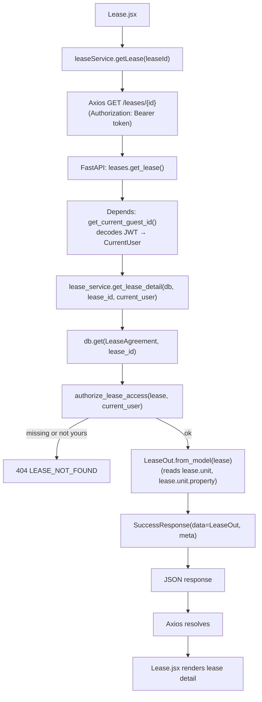

### `GET /api/v1/guests/{guest_id}/leases`

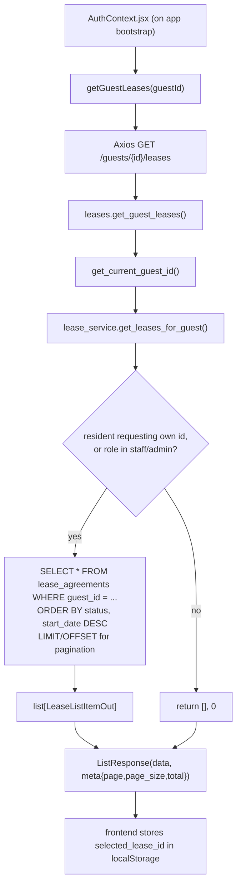

### `GET /api/v1/leases/{lease_id}/summary`

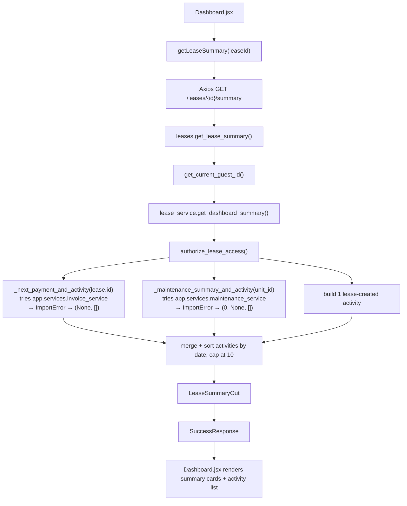

### `GET /api/v1/leases/{lease_id}/agreement`

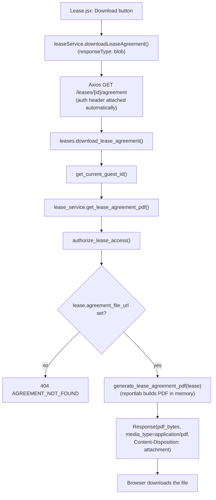

### `POST /api/v1/leases/{lease_id}/renewal-request`

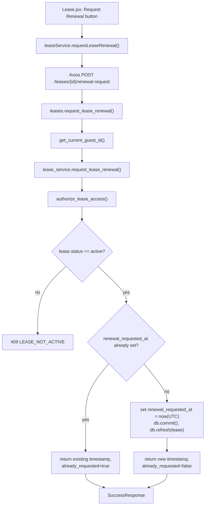

### `POST /api/v1/dev-auth/token`

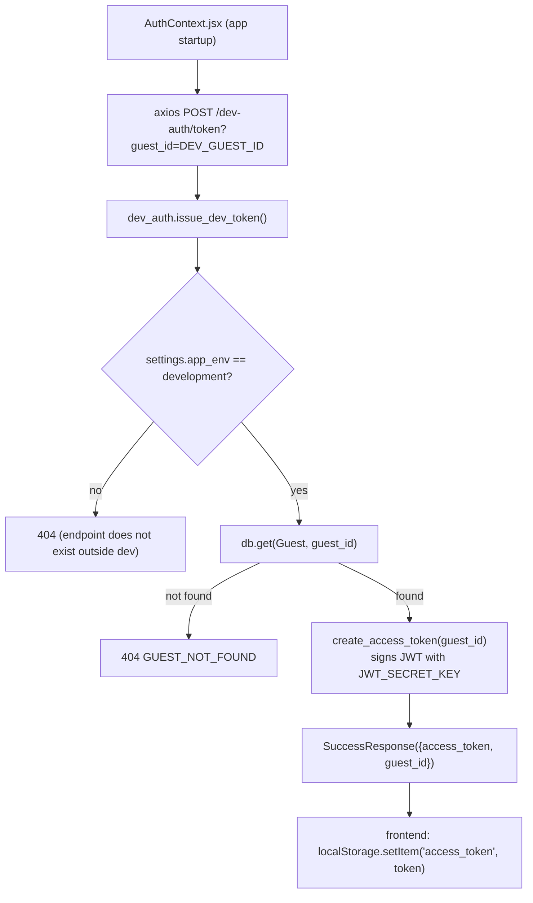

---

## 7. Authentication Deep Dive

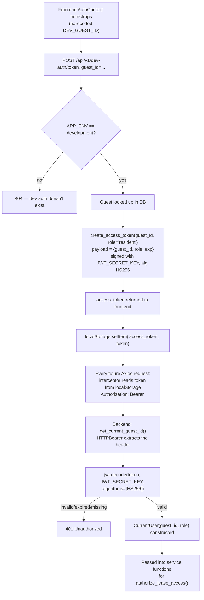

**Token payload** (from `create_access_token`): `{"guest_id": "<uuid-str>",
"role": "resident", "exp": <unix timestamp>}`.

**Expiration**: `JWT_EXPIRE_MINUTES` (from `.env`, default 60 in
`Settings`) — `AuthContext.jsx` deliberately always re-mints a fresh token
on every app load rather than trying to detect an expired one, because (per
its own comment) there's no clean way to distinguish "missing" from
"expired" without just trying — and re-minting is cheap in local dev.

**Why `/dev-auth/token` must never be treated as production auth**:
1. It has **no password check** — anyone who knows (or guesses/enumerates) a
   `guest_id` gets a valid token for that guest.
2. It only exists because `settings.app_env == "development"` — it 404s
   everywhere else by design, so it structurally cannot reach production.
3. Its own docstring states it explicitly: *"NOT part of the frozen API
   contract and NOT a real login story."*
4. There's no signup, no password hashing, no credential storage of any kind
   — this is a **testing convenience**, not an auth system.

`feature-lavanya` (see §20) implements what looks like real, password-based
auth (`resident_credential` model, `POST /auth/login`). That is the correct
direction for real authentication — `/dev-auth/token` is not meant to
evolve into it, it's meant to be deleted once something like that lands.

---

## 8. Authorization and IDOR Protection

**IDOR** = Insecure Direct Object Reference: a vulnerability where an
attacker changes an ID in a URL/request to access someone else's data,
because the server only checks "does this ID exist," not "does this ID
belong to the caller."

`authorize_lease_access(lease, current_user)` in `core/security.py` is the
single choke point that prevents this for every lease-owning endpoint:

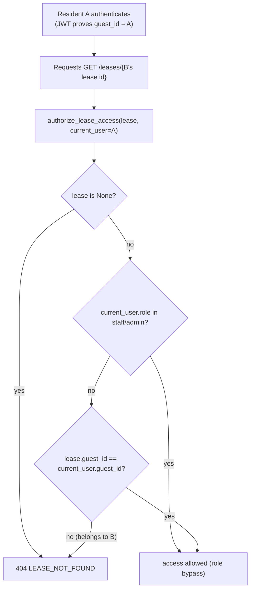

**Why 404, not 403, for "found but not yours"**: returning `403 Forbidden`
would confirm to an attacker *"this lease ID exists, you're just not allowed
to see it"* — useful information for enumerating valid IDs. Returning the
same `404 LEASE_NOT_FOUND` for both "doesn't exist" and "exists but isn't
yours" gives an attacker no way to distinguish the two cases. This is a
documented, deliberate decision (code comment cites "plan Decision 5").

The same pattern shows up slightly differently in `get_leases_for_guest`
(listing endpoint): instead of a 404, a non-owning resident just gets an
**empty list** — because there's no single "object" being denied, just a
query scoped to data that isn't theirs.

---

## 9. Database Deep Dive

**Engine**: PostgreSQL, database name from `DATABASE_URL` in `backend/.env`
(shape: `postgresql://<user>:<password>@<host>:<port>/<database>` — actual
credentials are local-only and intentionally not reproduced in this
document).

### Tables (verified against `app/models/*.py` and the 3 migrations)

**`guests`**
| Column | Type | Null? | Notes |
|---|---|---|---|
| id | UUID | no | PK |
| name | String | no | |
| email | String | no | |
| phone | String | yes | |
| loyalty_tier | String | yes | |
| created_at | TIMESTAMPTZ | no | UTC |

**`properties`**
| Column | Type | Null? | Notes |
|---|---|---|---|
| id | UUID | no | PK |
| name | String | no | |
| brand | String | yes | |
| address | String | yes | (contract note: intentionally `address`, not `location`) |
| timezone | String | yes | |

**`units`**
| Column | Type | Null? | Notes |
|---|---|---|---|
| id | UUID | no | PK |
| property_id | UUID | no | FK → properties.id |
| unit_number | VARCHAR(50) | no | unique together with property_id |
| unit_type | VARCHAR(50) | yes | e.g. "2BHK" |
| status | String | no | `available` \| `occupied` \| `maintenance` |
| created_at | TIMESTAMPTZ | no | UTC |

Unique constraint: `(property_id, unit_number)`.

**`lease_agreements`**
| Column | Type | Null? | Notes |
|---|---|---|---|
| id | UUID | no | PK |
| unit_id | UUID | no | FK → units.id, indexed |
| guest_id | UUID | no | FK → guests.id, indexed |
| start_date | DATE | no | |
| end_date | DATE | no | |
| monthly_rate | NUMERIC(12,2) | no | decimal in DB, plain JSON number on the wire |
| renewal_date | DATE | yes | |
| status | String | no | `pending` \| `active` \| `expired` \| `terminated`, indexed |
| agreement_file_url | String | yes | "available" marker, not a real path — additive column beyond the original frozen schema |
| renewal_requested_at | TIMESTAMPTZ | yes | additive (migration 0003) |
| created_at | TIMESTAMPTZ | no | UTC |
| updated_at | TIMESTAMPTZ | no | UTC |

### Relationships

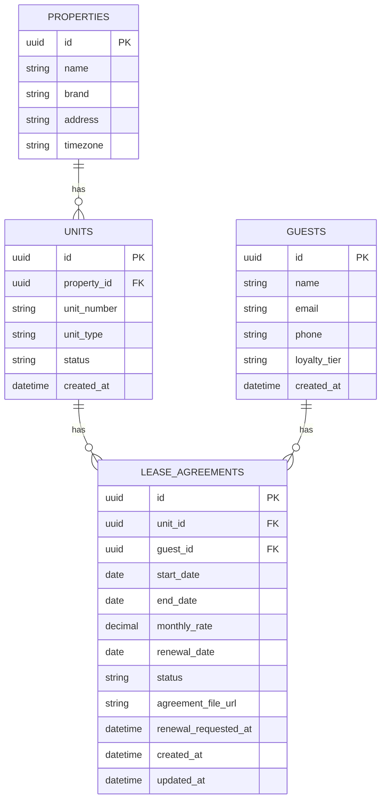

- All primary keys are UUIDs (contract rule — never mixed with integer IDs).
- All timestamps are UTC (`DateTime(timezone=True)`).
- Foreign keys always point from the "many" side to the "one" side
  (`lease_agreements.unit_id → units.id`, `lease_agreements.guest_id →
  guests.id`, `units.property_id → properties.id`).
- Indexes exist on `lease_agreements.unit_id`, `.guest_id`, `.status` —
  chosen because those are exactly the columns queried by the implemented
  endpoints (lookup by lease, list-by-guest, and future status filtering).

---

## 10. SQLAlchemy Flow

```
database.py
  engine = create_engine(DATABASE_URL, pool_pre_ping=True)
      ↓
  SessionLocal = sessionmaker(bind=engine)
      ↓
  get_db()  — FastAPI dependency, yields one Session per request
      ↓
  router/service receives `db: Session`
      ↓
  db.get(Model, id)              # PK lookup
  db.execute(select(Model)...)   # filtered/ordered/paginated query
      ↓
  SQLAlchemy compiles this to SQL via the Postgres dialect
      ↓
  psycopg2 sends it over the wire to PostgreSQL
      ↓
  rows come back → SQLAlchemy hydrates them into Python objects
  (instances of Guest / Property / Unit / LeaseAgreement)
      ↓
  relationships (lazy="joined") like lease.unit and lease.unit.property
  are fetched via SQL JOINs at the same time, not lazily per-attribute-access
```

Each model class (`class Guest(Base): __tablename__ = "guests"`) is a
**declarative mapping**: the class *is* the table definition, and each
`mapped_column(...)` is one column. SQLAlchemy uses this same class both to
generate SQL and to hydrate query results back into Python objects — there
is no separate "table schema" file; the model classes in `app/models/` are
the schema, at the ORM level (Alembic migrations are the parallel, explicit
history of how the *actual* database schema got to that state).

---

## 11. Alembic Migrations

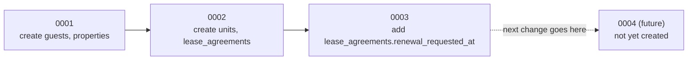

| Migration | Creates/changes | Why |
|---|---|---|
| `0001_create_shared_baseline_tables.py` | `guests`, `properties` | Cross-story shared baseline entities (contract §5.1) — needed before the lease story, which depends on both. |
| `0002_create_units_and_lease_agreements.py` | `units`, `lease_agreements` (+ 3 indexes, 1 unique constraint) | The lease story's own entities (contract §5.2/§5.3); `agreement_file_url` was added here as an additive column beyond the strictly-frozen schema, specifically for the "Download agreement" feature. |
| `0003_add_lease_renewal_requested_at.py` | Adds `lease_agreements.renewal_requested_at` (nullable) | Backs the "Request renewal" feature. Deliberately *not* a new value on the `lease_status` enum — renewal-requested is tracked as a separate timestamp, not a status change. |

Each migration has `down_revision` pointing to the previous one — this
chain is how Alembic knows the order to apply them in (`alembic upgrade
head` walks 0001 → 0002 → 0003) and how to reverse them one at a time
(`downgrade()` defined symmetrically in each file).

**Why existing migrations should not simply be edited**: once a migration
has been applied to any database (a teammate's local DB, a shared/CI
database, anything), editing its contents retroactively makes Alembic's
bookkeeping (the `alembic_version` table, which just stores "0003" as a
string) inconsistent with what that database's schema actually looks like.
The only safe way to change the schema further is a **new** migration file
(`0004_...py`) whose `down_revision = "0003"`. This is also a hard rule in
the team's contract (§24: "keep migrations additive and ordered").

---

## 12. Seed Data

`database/seed/seed_lease_story.py`:

- **What it creates**: 2 guests (`GUEST-001` "Demo Resident",
  `GUEST-002` "Other Resident"), 1 property (`PROP-001` "Meridian
  Residences"), 1 unit (`UNIT-101`), and 4 leases (`LEASE-001` active,
  `LEASE-002` pending, `LEASE-003` expired, `LEASE-004` terminated) —
  spread across both guests, so the "another resident's lease" IDOR case has
  real data to test against.
- **Why deterministic UUIDs**: `seed_id(label) = uuid.uuid5(SEED_NAMESPACE,
  label)` derives the same UUID for `"GUEST-001"` on every machine, every
  run — so every developer gets identical IDs locally without sharing a
  database dump or hardcoding random-looking UUIDs that only one person's
  DB actually has.
- **Why idempotent**: `_ensure(db, Model, id, factory)` only inserts a
  record if that exact ID doesn't already exist. This means re-running the
  script after a teammate adds more leases to the `LEASES` list only inserts
  what's new — it won't error or duplicate existing rows, and one developer
  can safely re-run it after pulling someone else's seed changes.
- **How this data reaches the frontend**: `AuthContext.jsx` hardcodes
  `DEV_GUEST_ID = "ed2f0283-bfb0-5722-b4ca-17bf2886db53"` — this **is**
  `GUEST-001`'s deterministic UUID. The frontend literally only works
  end-to-end (rather than falling back to demo data) if this seed script has
  been run against whatever database the backend is pointed at.
- **How to run it** (per the script's own docstring, from `backend/` with
  the venv active):
  ```
  DATABASE_URL=postgresql://<user>:<password>@localhost:5432/meridian_residences \
      python ../database/seed/seed_lease_story.py
  ```

This document does not modify this script, per the task's constraints.

---

## 13. Response Structure

`schemas/common.py` defines one envelope used by (almost) every endpoint:

```python
class Meta(BaseModel):
    request_id: str | None = None
    page: int | None = None
    page_size: int | None = None
    total: int | None = None

class SuccessResponse(BaseModel, Generic[T]):
    success: bool = True
    data: T
    message: str | None = None
    meta: Meta = Meta()

class ListResponse(BaseModel, Generic[T]):
    success: bool = True
    data: list[T]
    meta: Meta

class ErrorResponse(BaseModel):
    success: bool = False
    data: None = None
    message: str
    error_code: str
    meta: Meta = Meta()
```

**Why a shared envelope**: the frontend's Axios service layer (contract
rule: "pages/components never call Axios directly") is written once to
expect exactly this shape everywhere — `response.data.data` for the payload,
`response.data.message` for a human-readable string, `error_code` for
programmatic branching. Without this, every new backend story could invent
its own response shape and the frontend would need bespoke handling per
endpoint.

**The `Decimal` → JSON-number issue** (`schemas/lease.py`): Pydantic v2's
default JSON serialization of a bare `Decimal` field produces a **string**
(e.g. `"45000.00"`), specifically to avoid floating-point precision loss.
But the project's contract (§4) mandates "Money: decimal in DB; JSON number:
12500.00" — a real JSON number, not a string. The fix:
```python
MoneyAmount = Annotated[Decimal, PlainSerializer(lambda v: float(v), return_type=float, when_used="json")]
```
This keeps `Decimal` for all internal validation/arithmetic (no precision
loss in business logic) while forcing a plain `float`-shaped JSON number
only at the serialization boundary — satisfying the contract without
compromising internal correctness.

**Realistic example** (`GET /leases/{lease_id}` success — see §5 for the
full body) and a realistic error:
```json
{
  "success": false,
  "data": null,
  "message": "Lease not found.",
  "error_code": "LEASE_NOT_FOUND",
  "meta": {"request_id": "3f9e2c1a-..."}
}
```
This exact shape is produced automatically by `main.py`'s
`http_exception_handler`, whenever any router raises
`HTTPException(status_code=..., detail={"error_code": ..., "message": ...})`
— the handler unpacks that dict into the envelope.

---

## 14. Lease Story Deep Dive (User Story 1)

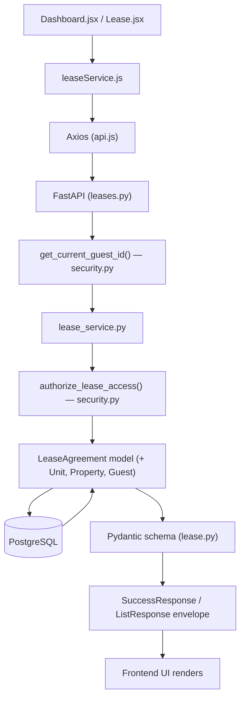

What's real, end to end, for each sub-feature:

- **Viewing lease details** (`GET /leases/{id}`) — fully real: real DB row,
  real relationships, real authorization.
- **Listing guest leases** (`GET /guests/{id}/leases`) — fully real,
  including real pagination and the own-data-only restriction.
- **Dashboard summary** (`GET /leases/{id}/summary`) — **partially real**:
  `lease_status`, `lease_end_date`, `unit`, and the one "lease agreement
  available" activity entry are real; `next_payment` and
  `open_requests`/`open_request_status` are **always `null`/`0`** on this
  branch because `invoice_service`/`maintenance_service` don't exist —
  confirmed by `test_dashboard_summary_degrades_gracefully_...` in
  `test_leases.py`, which explicitly asserts this.
- **Downloading agreement PDF** — fully real: a genuine PDF generated
  on-demand from the lease's actual data (see §5, §6).
- **Requesting renewal** — fully real: a genuine, persisted, idempotent
  state change in the database.

---

## 15. Dashboard Data Flow

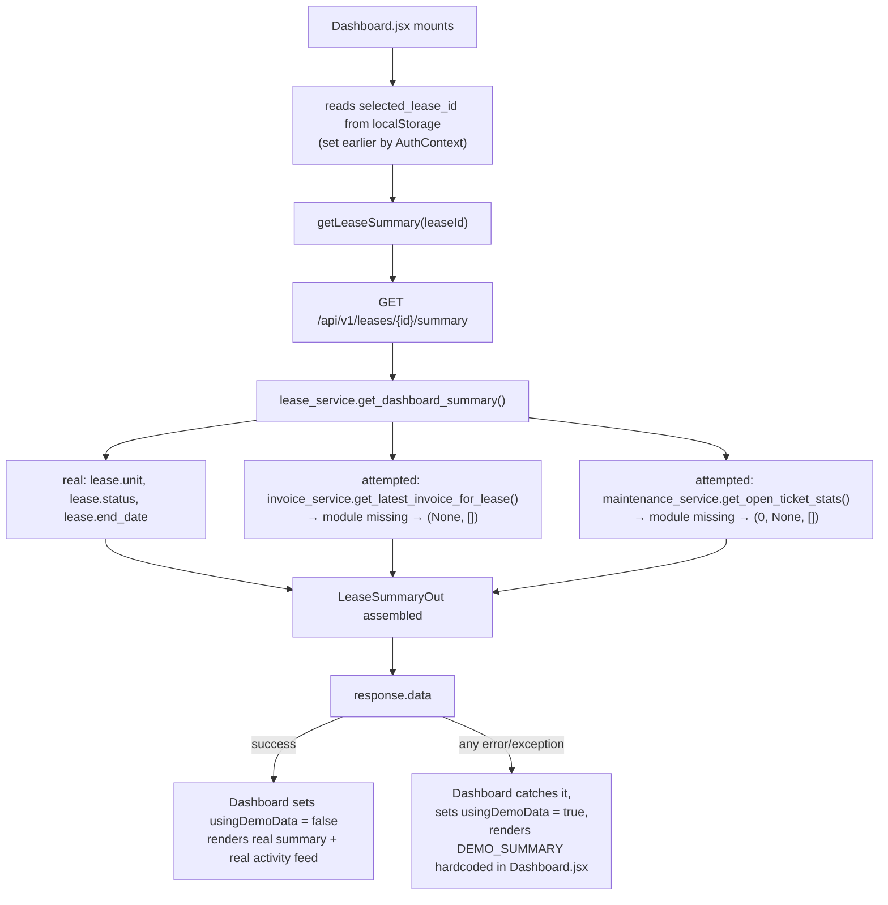

**Every field in `LeaseSummaryOut`, and its current source**:

| Field | Current source | Status |
|---|---|---|
| `lease_id` | `lease.id` | REAL |
| `unit` | `lease.unit` (unit_number, unit_type) | REAL |
| `next_payment` | `invoice_service.get_latest_invoice_for_lease()` | **Always `null`** — service doesn't exist |
| `open_requests` | `maintenance_service.get_open_ticket_stats()` | **Always `0`** — service doesn't exist |
| `open_request_status` | same | **Always `null`** |
| `lease_status` | `lease.status` | REAL |
| `lease_end_date` | `lease.end_date` | REAL |
| `activities` | merged invoice + maintenance + lease activities, sorted by date, capped at 10 | Only the single lease-created entry is ever real today; invoice/maintenance activity entries are never produced |

If the request fails for *any* reason (network error, CORS block, 401,
5xx), `Dashboard.jsx`'s `catch` block replaces the whole summary with a
hardcoded `DEMO_SUMMARY` object and shows a "Backend is not connected"
banner — this is why a broken backend connection looks like *demo data*
rather than a visible error (see §18).

---

## 16. Lease Page Data Flow

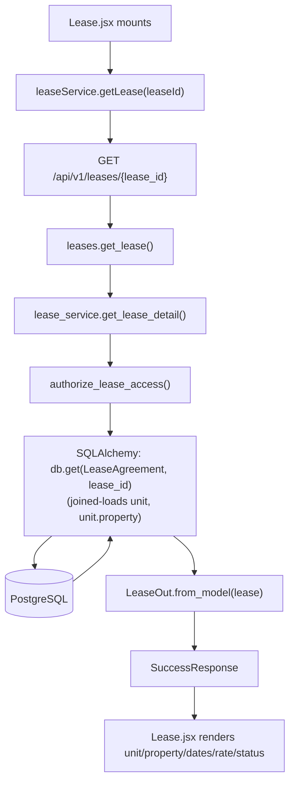

**Agreement PDF download**: a button in `Lease.jsx` calls
`leaseService.downloadLeaseAgreement(leaseId)`, which issues the GET through
the *same authenticated Axios instance* (not a plain `<a href>`) specifically
so the bearer token is attached — a static link wouldn't carry
authentication. The response (`responseType: "blob"`) is the raw PDF bytes
described in §5/§6.

**Renewal request**: a button calls
`leaseService.requestLeaseRenewal(leaseId)` → `POST
/leases/{id}/renewal-request` → the idempotent flow described in §6. The
frontend should treat both `already_requested: true` and `false` as success
— the backend never errors on a repeat click of an already-active request.

---

## 17. Frontend ↔ Backend Contract

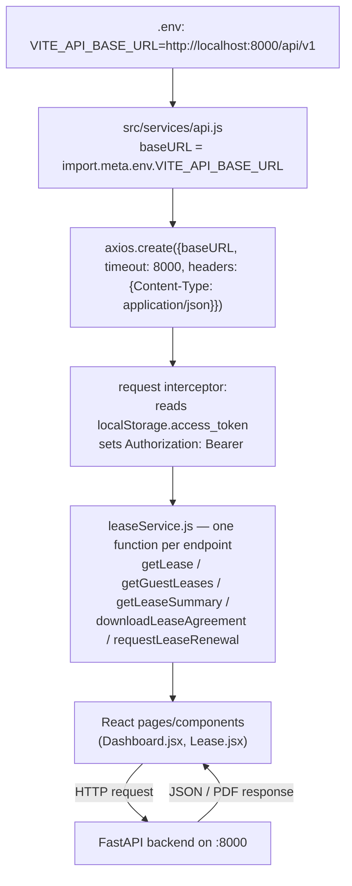

- `VITE_API_BASE_URL` is read at build/dev time by Vite
  (`import.meta.env.VITE_API_BASE_URL`); if unset, `api.js` falls back to
  the same default (`http://localhost:8000/api/v1`) hardcoded on the
  backend side as `settings.api_prefix`'s expected pairing.
- The Axios instance is created **once** in `api.js` and imported
  everywhere — this is the single place that knows the base URL, timeout,
  and default headers.
- The interceptor is what turns "a token exists in localStorage" into "every
  outgoing request is authenticated" — no individual page ever manually
  attaches the header.
- `leaseService.js` is the *only* file that imports `api.js` directly for
  lease data — pages import `leaseService`, never `api` (matches the
  contract's "pages/components do not call Axios directly" rule).

---

## 18. Error Handling

**Centralized exception handling** (`main.py`):
- `@app.exception_handler(StarletteHTTPException)` — catches every
  `HTTPException` raised anywhere in the app (auth failures, IDOR 404s,
  409 conflicts, etc.) and reshapes it into `{success: false, data: null,
  message, error_code, meta: {request_id}}`. If the route raised
  `HTTPException(detail={"error_code": ..., "message": ...})`, those values
  are used directly; if `detail` is just a string (e.g. FastAPI's own
  built-in `401` from `HTTPBearer`), `error_code` defaults to `"ERROR"`.
- `@app.exception_handler(RequestValidationError)` — catches Pydantic/FastAPI
  validation failures (e.g. an invalid UUID in a path parameter) and returns
  `422` with `error_code: "VALIDATION_ERROR"`, same envelope.

**What each status code means here** (per the contract, matching actual
code): `401` missing/invalid auth, `404` not found *or* not yours
(deliberately conflated for lease resources), `409` a business-rule
conflict (e.g. renewing a non-active lease), `422` a validation error
(bad UUID, out-of-range pagination).

**Frontend fallback to demo data**: every page-level data fetch
(`Dashboard.jsx`, `Lease.jsx`, and `AuthContext.jsx`'s bootstrap) wraps its
API call in `try { ... } catch { setUsingDemoData(true); ... }`. This means
literally *any* failure — the backend being down, a CORS rejection, an
expired/invalid token, a genuine 500 — looks identical to the user: a
"Backend is not connected" banner plus hardcoded demo data. This is
convenient for resilience but makes real bugs easy to miss during
development; see the debug checklist in §25 for how to look past it.

---

## 19. Current Implementation vs Planned

| Feature | Implemented? | Files | Notes |
|---|---|---|---|
| Lease detail / list / summary | **Yes** | `routers/leases.py`, `services/lease_service.py`, `schemas/lease.py` | Fully tested |
| Dashboard summary (partial data) | **Yes** (partially) | same as above | `next_payment`/`open_requests` always empty — see §15 |
| Lease agreement PDF | **Yes** | `services/lease_agreement_pdf.py` | Generated on demand, no file on disk |
| Renewal request | **Yes** | `services/lease_service.py` | Idempotent, real DB write |
| Dev authentication | **Yes** (dev-only) | `routers/dev_auth.py` | Gated to `APP_ENV=development`, no password |
| JWT verification | **Yes** | `core/security.py` | `get_current_guest_id` |
| IDOR protection | **Yes** | `core/security.py::authorize_lease_access` | Uniform 404 |
| Response envelope | **Yes** | `schemas/common.py` | Used everywhere except the PDF download and `/health` |
| Invoices | **No** (planned) | README only on this branch | Appears implemented on `feature-lavanya` |
| Maintenance | **No** (planned) | README only on this branch | Appears implemented on `feature-lavanya`, incl. AI triage |
| AI assistant / RAG | **No** (planned) | `app/ai/README.txt` only | Not implemented on any branch inspected |
| Real login | **No** (planned) | — | Appears implemented on `feature-lavanya` (`resident_credential`, `/auth/login`) |
| Shared baseline (reservations/rate_plans/folios/orders) | **No** (planned) | — | Named in original case-study starter, never created here |
| UiPath automation | **No** (planned) | `automation/uipath/README.txt` | No code |
| CI/CD, monitoring, AWS/Azure deploy | **No** (planned) | `.github/workflows/README.txt`, `deployment/*/README.txt`, `monitoring/README.txt` | No code |

---

## 20. `feature-lavanya` Branch

**Do not merge or check out anything — this section is informational only,**
based on `git ls-tree` / `git show` against `origin/feature-lavanya` without
switching branches.

This remote branch contains a substantially larger implementation than
`main`/`feature/member1-lease`:

- **Authentication**: a real `routers/auth.py` (`POST /auth/login` with
  email/password), `services/auth_service.py`
  (`InvalidCredentialsError`), `schemas/auth.py`, and a
  `models/resident_credential.py` model — i.e., an actual credential store,
  not a dev-only token mint.
- **Invoices**: `routers/invoices.py`, `services/invoice_service.py`,
  `schemas/invoice.py`, `models/recurring_invoice.py`.
- **Maintenance**: `routers/maintenance.py`, `services/maintenance_service.py`,
  `schemas/maintenance.py`, `models/maintenance_ticket.py`.
- **AI maintenance triage**: `app/ai/maintenance_triage_agent.py` — a real
  file, not a README stub (contents not modified or copied here; only its
  existence and location were confirmed).
- **`main.py`** on that branch registers `auth`, `guests`, `leases`,
  `invoices`, and `maintenance` routers — five, versus two on this branch.
- **Frontend**: a noticeably larger component set (`Button`, `Card`,
  `EmptyState`, `ErrorMessage`, `Input`, `InvoiceCard`, `LeaseCard`,
  `Loading`, `MaintenanceCard`, `Modal`, `PageHeader`, `PriorityBadge`,
  `ProtectedRoute`, `SecondaryButton`, `Select`, `StatCard`, `Textarea`) and
  real pages (`Login.jsx`, `Invoices.jsx`, `Maintenance.jsx`,
  `ComingSoon.jsx` in place of this branch's `PlaceholderPage.jsx`).

**Potential conflicts with `feature/member1-lease` if these are ever
merged**:

1. **Auth model mismatch**: this branch's frontend (`AuthContext.jsx`) and
   backend (`dev_auth.py`) assume a dev-only, password-less token flow;
   `feature-lavanya` assumes real login against `resident_credential`. These
   are two different authentication designs, not two compatible pieces —
   merging requires a decision, not a mechanical merge.
2. **`main.py` router registration** differs (2 routers vs. 5) — a
   straightforward textual merge conflict, easy to resolve, but the
   *decision* of which auth router wins is not.
3. **`schemas/lease.py` / `services/lease_service.py`** may have diverged
   independently on each branch since they share the same lease story —
   worth a careful diff rather than a blind merge, given `main`'s version
   here is the one with tests currently passing.
4. **Frontend component overlap**: this branch's `Sidebar.jsx`,
   `StatusBadge.jsx` exist on both branches with likely different content/
   styling — will need reconciliation, not just file-level merging.
5. **Model additions** (`resident_credential`, `recurring_invoice`,
   `maintenance_ticket`) will need their own Alembic migrations if merged —
   check whether `feature-lavanya` already has them before writing new ones.

---

## 21. What Happens When I Run the Application

**Backend, from zero:**
```
.env is read by pydantic-settings (Settings in core/config.py)
  ↓
create_engine(DATABASE_URL) — connection is lazy, not verified yet
  ↓
FastAPI() app object constructed — middleware + exception handlers attached
  ↓
routers (leases, dev_auth) registered under /api/v1
  ↓
Uvicorn binds to APP_HOST:APP_PORT (0.0.0.0:8000 by default per Settings,
  though this project's real .env / observed process uses 127.0.0.1:8000)
  ↓
first real request triggers the first actual DB connection (pool_pre_ping
  checks it's alive before each use)
  ↓
server is now serving /api/v1/* and /health
```

**Frontend, from zero:**
```
npm install — resolves react, react-dom, react-router-dom, axios,
  lucide-react, vite, @vitejs/plugin-react per package.json
  ↓
npm run dev — Vite starts a dev server (default :5173, or the next free
  port if occupied)
  ↓
Vite serves index.html → loads src/main.jsx → mounts <App /> (App.jsx)
  ↓
AuthContext bootstraps: POSTs to /dev-auth/token, stores JWT + lease id
  ↓
React Router renders Dashboard.jsx at "/" → "/dashboard" redirect
```

**How the two processes actually communicate**: purely over HTTP, as two
independent OS processes — there's no shared memory, no direct import, no
IPC. The only coupling is the URL (`VITE_API_BASE_URL` on one side,
`APP_HOST`/`APP_PORT` on the other) and the response contract
(`schemas/common.py` on the backend, the expectations baked into
`leaseService.js` on the frontend). Either process can be restarted
independently without affecting the other, as long as the URL/contract
stays the same — this is exactly what was exploited earlier in this
project's history to consolidate/relocate the frontend without touching a
live backend process.

---

## 22. Local Development Guide

Commands actually supported by this repository (verified against
`requirements.txt`, `package.json`, `alembic.ini`, and the seed script's own
docstring):

**1. PostgreSQL**: must already be running locally, reachable at whatever
`DATABASE_URL` in `backend/.env` points to, with the target database created
(this repo does not create the database itself).

**2. Alembic migrations** (run from the repo root, since `alembic.ini` sets
`script_location = database/migrations` and `prepend_sys_path = backend`):
```
alembic upgrade head
```

**3. Seed data** (from `backend/`, with the virtualenv active):
```
DATABASE_URL=postgresql://<user>:<password>@localhost:5432/meridian_residences \
    python ../database/seed/seed_lease_story.py
```

**4. FastAPI**:
```
cd backend
python -m venv .venv
.venv\Scripts\activate
pip install -r requirements.txt
uvicorn app.main:app --host 127.0.0.1 --port 8000
```

**5. React frontend** (separate terminal, from the frontend project):
```
npm install
npm run dev
```
Opens on `http://localhost:5173` (or the next free port — see §25 for why
that matters for CORS).

**Required environment variables** (`backend/.env`): `DATABASE_URL`,
`JWT_SECRET_KEY`, `CORS_ORIGINS` at minimum (others — `APP_NAME`,
`APP_ENV`, `APP_HOST`, `APP_PORT`, `API_PREFIX`, `JWT_ALGORITHM`,
`JWT_EXPIRE_MINUTES`, `LOG_LEVEL` — have working defaults in
`core/config.py` if omitted, but `APP_ENV` in particular determines whether
`/dev-auth/token` even exists). Frontend: `VITE_API_BASE_URL` (has a
working default too).

---

## 23. Beginner Explanation — "Backend in 10 Minutes"

If you know React, here's the backend in terms you already have intuition
for:

- **FastAPI** is like Express (Node) or a Python equivalent of a React
  framework's server layer — it turns "a function" into "an HTTP endpoint."
  `main.py` is roughly the equivalent of your app's root component: it
  assembles everything and starts it running.

- **A router** (`routers/leases.py`) is a *file that groups related
  endpoints*, similar to how you might group related pages under one route
  file. Each function decorated with `@router.get(...)` /
  `@router.post(...)` is one endpoint — comparable to one route handler.

- **A dependency** (`Depends(get_db)`, `Depends(get_current_guest_id)`) is
  FastAPI's version of a React hook that runs *before* your component body:
  it prepares something (a DB session, a decoded user) and hands it to the
  function as an argument. You don't call it yourself — FastAPI calls it for
  you based on the function's parameter list.

- **A service** (`services/lease_service.py`) is where the actual logic
  lives — think of it like a custom hook or a utility module that a
  component (router) calls into, instead of writing business logic directly
  inline in the route handler. This keeps routers "dumb" (just HTTP
  plumbing) and services "smart" (the actual rules).

- **A model** (`models/lease_agreement.py`) is a Python class that
  represents one database table — similar to a TypeScript interface, except
  it's also *executable*: SQLAlchemy uses the same class both to generate
  the SQL and to turn query results back into objects you can access with
  `.dot syntax` (`lease.status`, `lease.unit.unit_number`).

- **A schema** (`schemas/lease.py`) is a Pydantic class describing the
  *shape of data going in or out over HTTP* — comparable to a Zod/Yup schema
  or a strict TypeScript type used specifically for API payloads, not for
  the database. Models and schemas look similar but serve different layers:
  models are "what's in the DB," schemas are "what's in the JSON."

- **A database session** (`db: Session`) is like a single "conversation"
  with the database for the duration of one request — you read/write
  through it, and it's closed automatically when the request finishes
  (`get_db`'s `try/finally`).

- **Middleware** (CORS, request-id) is code that runs on *every* request
  before/after your route handler — similar to Express middleware, or a
  higher-order component that wraps your whole app.

- **JWT** (JSON Web Token) is a signed, tamper-evident string the backend
  hands the frontend after "login" (`/dev-auth/token` here). The frontend
  stores it (in `localStorage`) and sends it back on every request
  (`Authorization: Bearer <token>`); the backend verifies the signature to
  trust the claims inside (who this is) without needing a database lookup
  for every single request.

- **A migration** (`database/migrations/versions/0001_...py`) is a
  version-controlled, ordered script that changes the actual database
  schema — like a Git commit, but for table structure instead of code. You
  never "just edit" the database by hand; you write a new migration.

- **PostgreSQL** is the actual database server storing the real rows.
  **SQLAlchemy** is the Python library translating between "Python objects"
  (models) and "SQL" (what Postgres understands) — you write `db.get(Guest,
  id)`, and SQLAlchemy turns that into `SELECT * FROM guests WHERE id = ...`.

---

## 24. Important Rules for Future Development

Distilled from the project's design contract and the patterns already
established in the code you'll be extending:

1. **Reuse the response envelope** (`schemas/common.py`) for every new
   endpoint — `SuccessResponse`/`ListResponse`/`ErrorResponse`. Never invent
   a new shape.
2. **Naming is frozen**: snake_case DB tables/columns, PascalCase Python
   classes, snake_case Python filenames, `/api/v1/<plural-noun>` URL paths,
   snake_case JSON fields. Don't create variants of an existing name
   (e.g. `leaseId` vs `lease_id`).
3. **All primary/foreign keys are UUIDs** — never mix in integer IDs, even
   for a "just one new small table."
4. **All timestamps are UTC**, stored as `DateTime(timezone=True)` /
   `TIMESTAMPTZ`, named `created_at`/`updated_at` by convention.
5. **Money is `Decimal` in the DB and Python, but a plain JSON number on the
   wire** — follow the `MoneyAmount` pattern in `schemas/lease.py` for any
   new money field; don't let Pydantic's default string-serialization of
   `Decimal` leak into a response.
6. **Centralize IDOR checks** — reuse (or extend, don't duplicate)
   `core/security.py::authorize_lease_access`-style logic for any new
   resource a resident should only see their own copy of. Return `404` for
   "not yours," not `403`.
7. **Migrations are additive and ordered** — never edit `0001`–`0003`; add a
   new numbered migration with `down_revision` pointing at the current head.
8. **Respect service boundaries**: read another story's data through *that
   story's service function*, never by importing its model and querying its
   table directly (see `lease_service.py`'s soft-import pattern as the
   template for a cross-story dependency that might not exist yet).
9. **Shared files need care, not solo rewrites**: `main.py`,
   `core/config.py`, `core/database.py`, `.env.example`,
   `database/migrations/` are explicitly called out as shared/coordinate-
   before-changing in the contract.
10. **Authentication rule**: never trust a `guest_id` supplied by the
    browser (path/query/body) as the sole authorization check — identity
    must always come from the verified JWT (`get_current_guest_id`).
11. **PII/LLM rule**: once you touch anything AI/assistant-related, never
    send guest PII to an LLM unless the approved design explicitly requires
    and permits it. Never log passwords, tokens, API keys, or full sensitive
    guest data.
12. **`/dev-auth/token` is not a pattern to extend** — it is meant to be
    replaced by real authentication, not built upon.

---

## 25. Final "How to Debug" Section

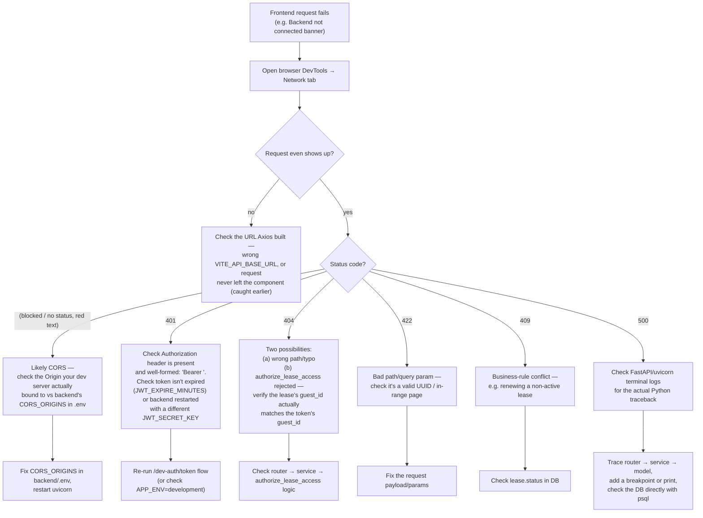

**What to check at each stage, concretely**:
1. **Network tab first, always** — this project's frontend swallows almost
   every error into a generic "demo data" fallback (§18), so the browser's
   own Network tab is the only reliable signal of what actually happened.
2. **The exact URL** — confirm it's hitting `:8000/api/v1/...`, not `:5173`
   (a relative-URL mistake) or a stale cached URL.
3. **Port 8000 reachable at all** — `curl http://localhost:8000/health`
   bypasses the browser and CORS entirely; if this fails, the backend
   process itself isn't running or is bound to a different host/port.
4. **CORS** — remember `curl` never shows CORS problems (it's a
   browser-only restriction); if `curl` succeeds but the browser fails,
   CORS is almost certainly the cause. Check exactly which port your Vite
   dev server actually bound to (it auto-increments past a used port) versus
   `CORS_ORIGINS` in `backend/.env`.
5. **JWT** — check `localStorage.getItem("access_token")` in the browser
   console; decode it (e.g. jwt.io) to confirm `guest_id`/`exp` look sane;
   confirm the backend's `JWT_SECRET_KEY` hasn't changed since the token was
   issued (changing it invalidates every previously-issued token).
6. **FastAPI/uvicorn terminal logs** — any unhandled exception prints a full
   traceback here; this is the fastest way to see a real `500` cause.
7. **Router** — confirm the endpoint is actually registered (check
   `main.py`'s `include_router` calls) and the path/method match exactly.
8. **Service** — add a temporary `print()`/logger call inside the service
   function to confirm it's being reached and what it's receiving.
9. **Database** — connect directly with `psql` (or any Postgres client)
   using the same `DATABASE_URL`, and manually run the equivalent `SELECT`
   to confirm the data actually looks like what the code assumes.
10. **Response schema** — if the request succeeds but the frontend renders
    wrong/missing data, compare the actual JSON (Network tab → Response) to
    the Pydantic schema in `schemas/lease.py` field-by-field.
